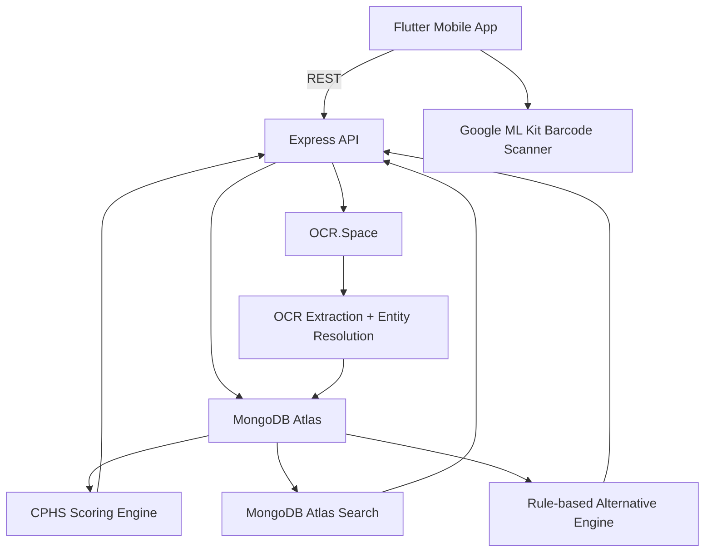

# ScanToKnow Architecture

## Main flows

### Barcode

Camera → ML Kit barcode detection → `GET /v1/scan/:barcode` → variant lookup → product/ingredient/additive enrichment → CPHS → Flutter detail screen.

### OCR

Camera image → multipart upload → validation/rate limiting → OCR.Space → ingredient-section extraction → E-code detection → cached ingredient/additive dictionary → exact/partial/fuzzy matching → unresolved-term reporting → Flutter result screen.

### Search

Flutter query → Atlas Search autocomplete/full search → filters/facets → parent product lookup → paginated variant cards.
